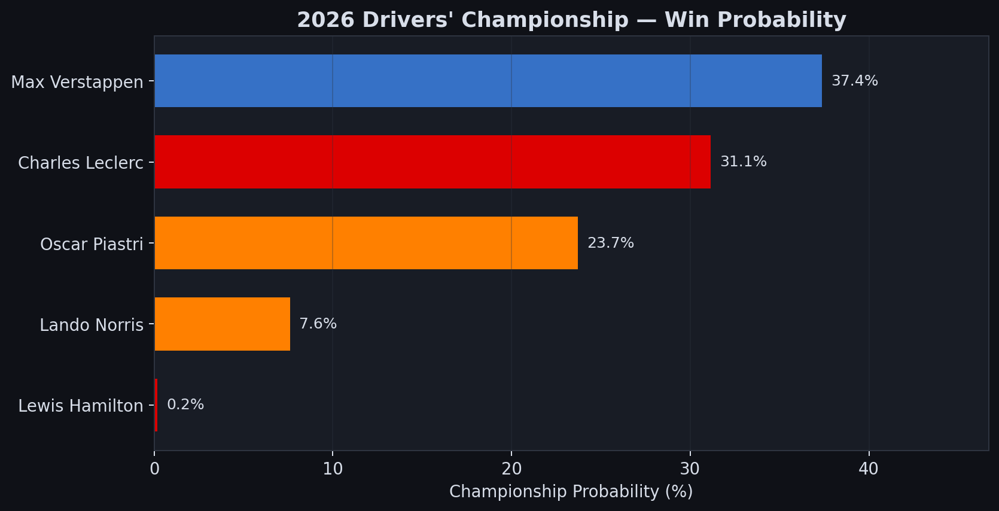
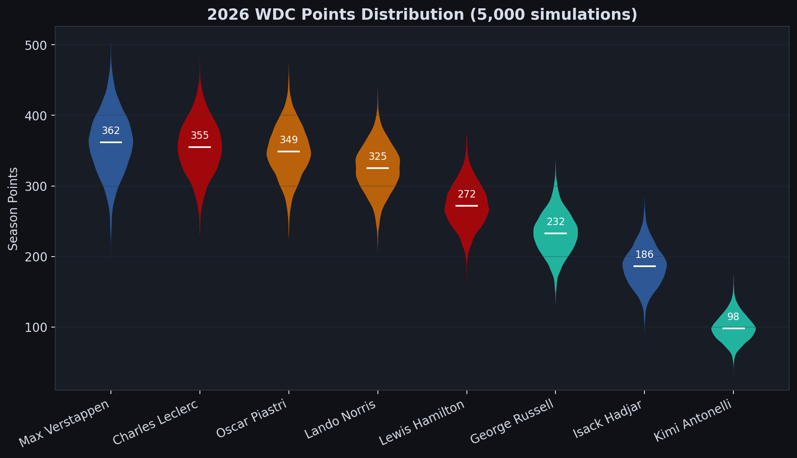
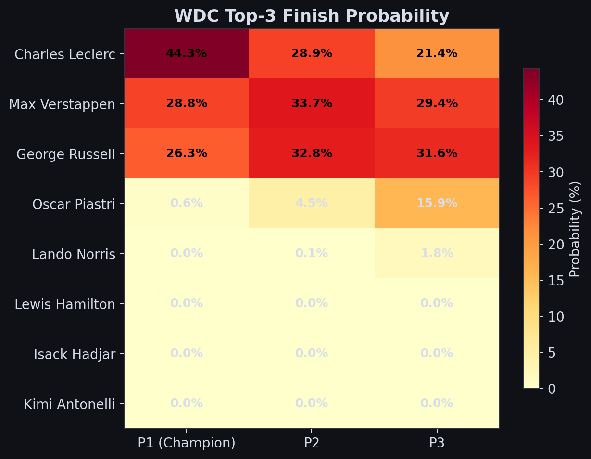
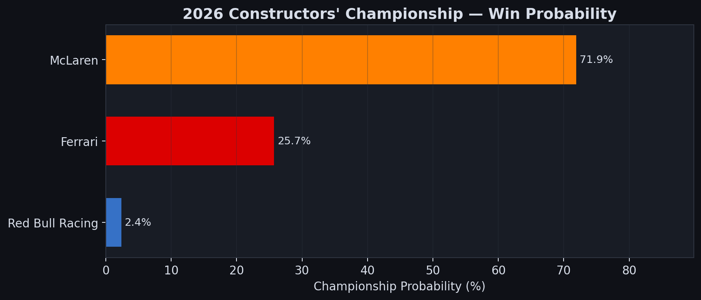
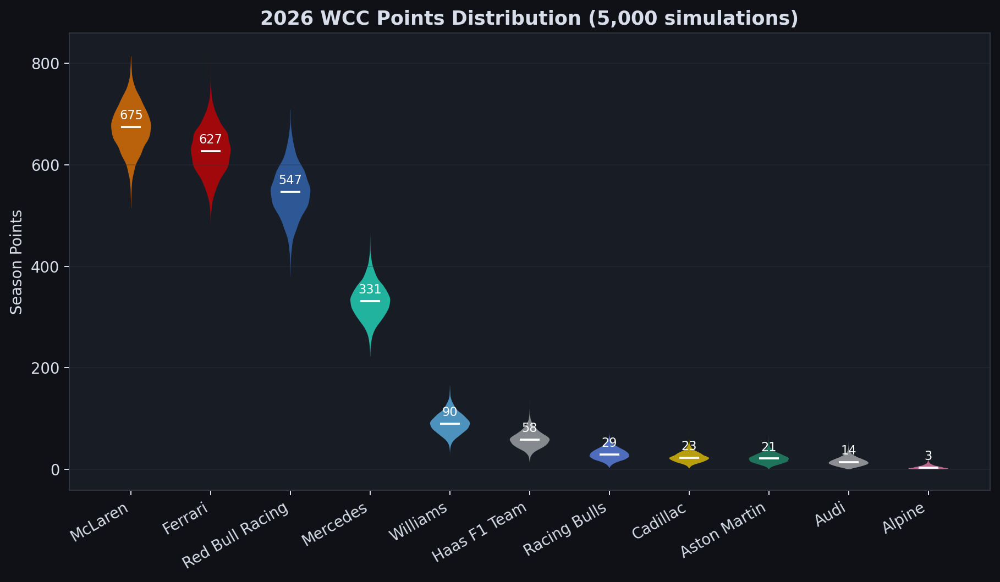
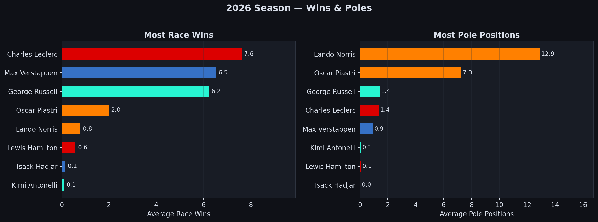
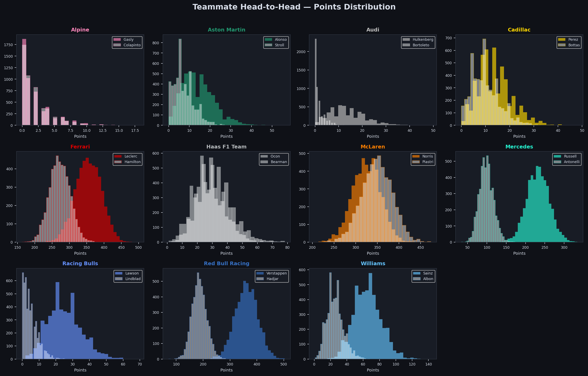
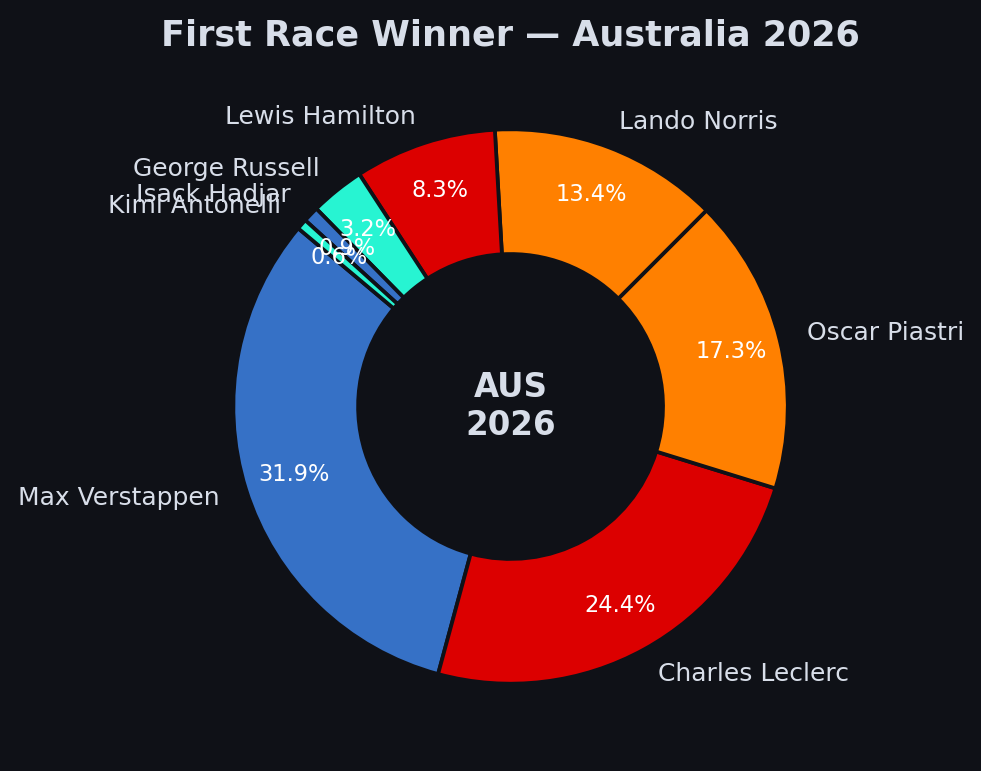

# F1 2026 Season Predictor

Predicting the 2026 Formula 1 season using machine learning and Monte Carlo simulation.

Built on **7 years of historical F1 data** (2019-2025) collected via [FastF1](https://github.com/theOehrly/Fast-F1), with XGBoost models and 5,000 simulated seasons to generate probabilistic predictions.



---

## What it predicts

| Category | Prediction |
|---|---|
| Drivers' Champion | Max Verstappen (37.4%) |
| WDC P2 | Charles Leclerc |
| WDC P3 | Oscar Piastri |
| Constructors' Champion | McLaren (71.9%) |
| WCC P2 | Ferrari |
| WCC P3 | Red Bull Racing |
| Most Race Wins | Max Verstappen (7.3 avg) |
| Most Pole Positions | Lando Norris (11.4 avg) |
| First Race Winner | Max Verstappen (31.2%) |

## How it works

### 1. Data Collection
Historical race and qualifying results for 2019-2025 are pulled from the official F1 timing data via FastF1. Team and driver names are normalised across seasons to handle rebrands (e.g. Alpine = Renault, Racing Bulls = AlphaTauri = Toro Rosso).

### 2. Feature Engineering
Each driver-race entry gets rolling window features computed from prior races only (no data leakage):

**Driver features** (window = 20 races, shifted by 1):
- Rolling average finish position, points, DNF rate
- Win rate, podium rate, consistency (std dev of finishes)
- Position delta (grid vs finish — racecraft)
- Teammate delta (finishing position vs teammate — isolates driver skill from car)
- Experience (career race count)

**Team features:**
- Rolling team average finish, points, DNF rate
- Regulation change adaptability (2021 vs 2022 performance delta — proxy for how teams handle new rules)
- Development trajectory (season-over-season improvement)

### 3. XGBoost Models
Two models are trained:

- **Position model** (XGBRegressor) — predicts finishing position given grid position + rolling features. Cross-validated MAE: ~2.74 positions.
- **DNF model** (XGBClassifier) — predicts probability of retirement/DNF.

Top feature importances:
```
grid_position                 0.284
rolling_avg_points            0.267
team_rolling_avg_finish       0.076
team_rolling_avg_points       0.063
rolling_win_rate              0.044
```

### 4. 2026 Driver Profiles
Each of the 22 drivers on the 2026 grid gets a feature profile built from their recent historical performance and their new team's car performance. Rookies (Arvid Lindblad) get proxy features based on grid medians with appropriate penalties.

### 5. Monte Carlo Simulation
For each of the 5,000 simulated seasons:
1. **Qualifying** is simulated per race using a blend of driver qualifying pace + team car performance + noise, weighted toward recent form (last 2 seasons)
2. **Race finishing positions** are predicted by the XGBoost model from the qualifying result + driver/team features
3. **DNFs** are sampled from the DNF model's predicted probabilities
4. Points are accumulated across all 24 races

The simulation aggregates championship standings, wins, poles, and podium positions across all runs.

---

## Visualizations

### WDC Points Distribution


### WDC Top-3 Probability Heatmap


### Constructors' Championship



### Wins & Poles


### Teammate Head-to-Head


### First Race Winner (Australia)


---

## 2026 Grid

| Team | Driver 1 | Driver 2 |
|---|---|---|
| McLaren | Lando Norris | Oscar Piastri |
| Ferrari | Charles Leclerc | Lewis Hamilton |
| Red Bull Racing | Max Verstappen | Isack Hadjar |
| Mercedes | George Russell | Kimi Antonelli |
| Aston Martin | Fernando Alonso | Lance Stroll |
| Alpine | Pierre Gasly | Franco Colapinto |
| Haas F1 Team | Esteban Ocon | Oliver Bearman |
| Racing Bulls | Liam Lawson | Arvid Lindblad |
| Williams | Carlos Sainz | Alexander Albon |
| Audi | Niko Hulkenberg | Gabriel Bortoleto |
| Cadillac | Sergio Perez | Valtteri Bottas |

---

## Quick start

```bash
pip install -r requirements.txt
python main.py
```

On first run, FastF1 downloads ~22 MB of session data (cached locally in `f1_cache/`). Subsequent runs use the cached CSV files and skip the download.

The full pipeline (data loading, feature engineering, model training, 5,000 season simulations, and plot generation) runs in ~10 minutes.

## Project structure

```
f1_2026_predictor/
  config.py           # 2026 lineup, team/driver mappings, calendar, points system
  collect_data.py     # FastF1 data collection with retry logic
  features.py         # Feature engineering (driver, team, rookie, training data)
  model.py            # XGBoost models, qualifying/race simulation, Monte Carlo
  visualizations.py   # 8 dark-themed plots with F1 team colours
  main.py             # Orchestrates the full pipeline
  requirements.txt
  plots/              # Generated visualizations
```

## Limitations

- **2026 is a major regulation change** (new power units, new aero rules). The model uses 2021-to-2022 regulation change performance as a proxy for adaptability, but there's inherent uncertainty in how teams will perform under entirely new rules.
- **New team (Cadillac)** has no historical data — assigned conservative baseline features.
- **Rookie (Lindblad)** has no F1 race history — assigned degraded median features.
- The model assumes the current driver-team lineup is final and doesn't account for mid-season changes.
- Qualifying simulation is heuristic-based (not directly modelled by XGBoost) since qualifying position is an input feature, not an output.
